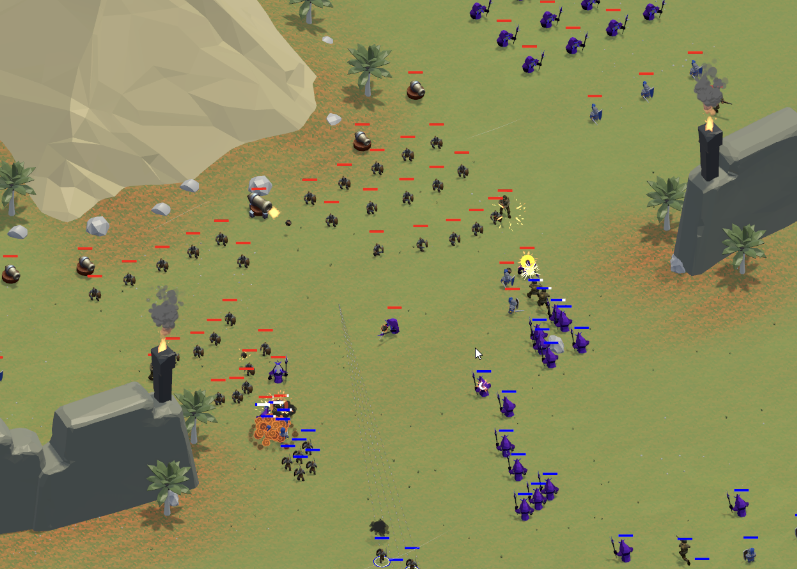
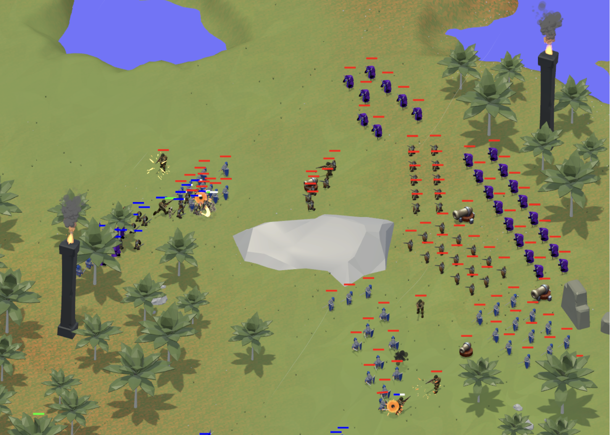

### RTS Game Jam

This is an RTS game built in Unity in about 15 hours, spread across 7 days.

A full breakdown of the game with pictures is in the [Design Document PDF](./DesignDocument.pdf) at the root of the repo.

To play it, download the Windows build from the [Builds](./Builds) folder.

It features two maps, multiple types of units, a custom & simple behaviour tree AI implementation, win & lose states, a main menu, and functional camera controls, as well as unit controls.

Everything apart from the 3D models with their animations has been built from scratch in Unity.

